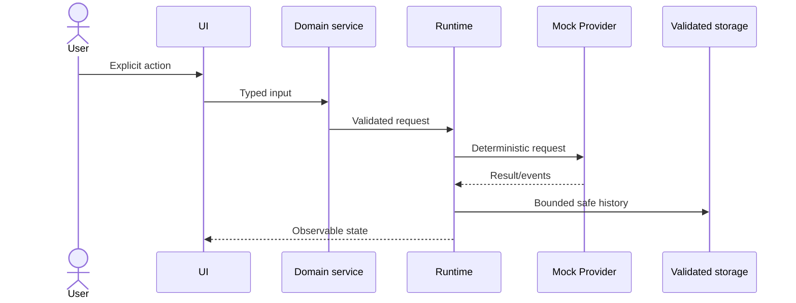

# Data Flow Architecture

## Purpose

Show how user input, built-in definitions, runtime events, and persistence move through the system.

## Current state

Current libraries use explicit import from immutable catalogs into validated local stores. Sprint 7 extends the pattern to agents, packs, playground drafts, and run history.

## Decision and constraints

Validate at entry, normalize once, create immutable requests, emit append-only run events, and persist only bounded non-secret records.

## Dependency boundaries

## Anti-patterns

UI cannot skip validation or write raw adapters. Catalog imports produce new personal IDs and preserve provenance.

## Testing impact

Executing imported text, persisting entire catalogs, mutable event histories, or treating displayed logs as provider truth.

## Future evolution

Unit-test every boundary and Playwright-test explicit action, persistence, attribution, and failure presentation.

## Related documents

Future live flows insert a secure gateway between runtime and provider without moving secrets into the browser.
