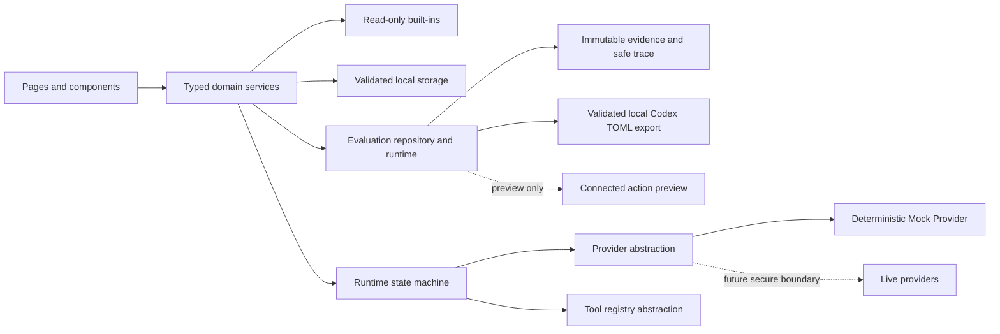

# Architecture Overview

## Purpose

Define the controlling system shape for Shabi's AI Academy 1.9.0-beta.1 and its post-release follow-up.

## Current state

The application is a React + TypeScript + Vite single-page application with
public and protected routes. It provides bilingual learning, local builders,
Version 1.8 Agent Teams and Missions, and a Version 1.9 deterministic Agent
Evaluation Lab. There is no production evaluation backend or live model
provider. Connected workflows remain preview-only.

## Decision

Use feature-oriented domain modules behind pages and contexts. UI components consume typed domain services; storage, providers, and tools remain behind abstractions.

```mermaid
flowchart LR
  UI[Pages and components] --> Domain[Typed domain services]
  Domain --> Catalog[Read-only built-ins]
  Domain --> Storage[Validated local storage]
  Domain --> Runtime[Runtime state machine]
  Domain --> Evaluation[Evaluation repository and runtime]
  Evaluation --> Evidence[Immutable evidence and safe trace]
  Evaluation --> Export[Validated local Codex TOML export]
  Evaluation -. preview only .-> Connector[Connected action preview]
  Runtime --> Provider[Provider abstraction]
  Runtime --> Tools[Tool registry abstraction]
  Provider --> Mock[Deterministic Mock Provider]
  Provider -. future secure boundary .-> Live[Live providers]
```

## Principles and constraints

- React + TypeScript + Vite; TypeScript remains strict.
- Local-first until a real backend is deliberately introduced.
- Built-in catalogs never become user-owned until explicit import.
- Mock and Dry Run are deterministic prerequisites to Live Run.
- Provider and tool registries are abstractions; UI never calls provider APIs.
- Evaluation runs freeze version references, use bounded deterministic
  simulations, and never turn missing evidence into a zero score.
- Evaluators are read-only and cannot certify their own implementation.
- Certified results, evidence, and baselines are immutable; rollback creates a
  new version.
- Connected previews expose target, fields, permissions, risk, and recovery but
  never perform an external write.
- External data is untrusted plain data and is never executed.
- Secrets never enter localStorage, bundles, fixtures, screenshots, or logs.
- Hebrew RTL and English LTR are complete, semantic experiences.
- Accessibility and quality gates are default architecture concerns.
- Status labels describe observed state; no fabricated live connectivity.

## Dependency boundaries

Pages may import components, contexts, translations, and public domain APIs. Domain code must not import pages. Provider adapters and storage modules must not depend on React. Catalog data is immutable. Cross-feature imports require a shared domain reason, not convenience.

## Anti-patterns

Direct localStorage parsing in components, duplicated state machines, provider calls in click handlers, mutable catalog objects, HTML execution from external text, direction-specific pixel hacks, and claims that a conceptual tool is connected.

## Testing impact and evolution

Domain transitions, validators, serialization, and imports require Vitest. User-visible flows require Playwright, axe, representative visuals, and Lighthouse on primary routes. A backend, live providers, MCP, and synchronization require new accepted ADRs and threat models.

Related: [coding boundaries](coding-standards.md), [runtime](runtime.md), [security](security.md), [Sprint 7](../sprint-7/00-master-spec.md), [ADRs](../adr/README.md).
