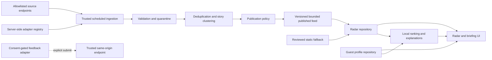

# Version 1.7.0-beta.1 master specification

Status: planning; architecture audit complete; implementation has not started.

## Release identity

- Baseline commit: `7512321d0c50901dafbf2ba7472e73a3ea9aa920`
- Baseline version: `1.6.0-beta.1`
- Working branch: `feature/1.7-public-beta-live-radar-personalization`
- Target version: `1.7.0-beta.1`
- Release name: **Public Beta — Live AI Radar + Guest Personalization**
- Release state: `planning`

## Product decision

Version 1.7 combines live multi-source AI Radar with anonymous, local-first
personalization. Core Academy value must be available without registration or
login. Production registration, login, password recovery, email verification,
account migration, cloud profiles, cloud favorites, and cross-device sync are
not Version 1.7 work.

Existing authentication code and accepted authentication ADRs are historical
capabilities. They must not be expanded, required, or embedded in new Radar,
briefing, profile, feedback, or personalization domain contracts in this
release. Any decision to remove or supersede those capabilities is separate
work.

## Objective

Ship a truthful bilingual public beta that:

1. consumes a bounded same-origin Radar feed produced by trusted scheduled
   infrastructure;
2. remains useful from a reviewed static fallback when online publication
   fails;
3. groups duplicate coverage and preserves provenance for every published
   record;
4. provides a versioned anonymous guest profile, interests, following,
   favorites, read state, saved searches, recommendations, a daily briefing,
   and “what changed” entirely on the current device;
5. supports validated export, previewed import with rollback, and reset;
6. collects feedback safely and records analytics only after explicit consent;
7. keeps user-owned records independent of server-generated Radar records so a
   future authenticated migration does not require rewriting the UI.

## Controlling discovery documents

1. [Architecture audit](../../docs/version-1.7/architecture-audit.md)
2. [Current and target data flow](../../docs/version-1.7/data-flow.md)
3. [Threat model](../../docs/version-1.7/threat-model.md)
4. [Test strategy](../../docs/version-1.7/test-strategy.md)
5. [Migration to future authentication](../../docs/version-1.7/migration-to-auth.md)

These documents describe confirmed current behavior separately from target
behavior. They do not claim that Version 1.7 features already exist.

## Architectural invariants

- Browser code never receives provider credentials, source-management
  credentials, privileged database keys, or signing secrets.
- Browser network access is limited to same-origin bounded endpoints or
  generated feeds plus user-initiated links to validated original sources.
- Every external payload begins as `unknown`; unknown fields are discarded.
- External instructions, HTML, Markdown, and prompt-like text remain inert
  data and are never executed.
- The reviewed fallback is immutable from the online refresh path and cannot
  be erased by a failed or partial run.
- Publication state, source health, cache age, partial coverage, last success,
  and last failure are distinct facts. The UI never infers “online” from the
  presence of cached records.
- Personalization is inspectable local ranking. `Latest` remains
  non-personalized, source diversity is enforced, and major safety/release news
  cannot be hidden by preference filters.
- `anonymousProfileId` is a random local identifier, not authentication. It is
  not transmitted without the user’s explicit analytics consent.
- Guest-owned records, server-generated Radar records, and optional analytics
  records use separate storage and repository boundaries.
- User-owned arrays, histories, caches, logs, imports, retries, and payloads
  are bounded and have documented retention.
- Hebrew RTL and English LTR, keyboard access, screen readers, mobile,
  desktop, offline, empty, partial, loading, failure, retry, and recovery
  states are release requirements.

## Architecture decision gates

Implementation must not begin for the affected slice until the relevant
decision is recorded as an accepted ADR:

1. **Scheduled Radar ingestion and publication.** Supersede the manual-only
   publication constraint in ADR-013 without weakening its reviewed fallback
   or no-client-secret boundary. Define artifact publication for GitHub Pages
   and the same-origin Vercel feed/API contract.
2. **Guest profile repository.** Define the versioned `GuestProfileRepository`
   contract, retention, corruption recovery, import transaction, and future
   account migration boundary, consistent with ADR-003 and ADR-012.
3. **Consent and feedback boundary.** Define local consent defaults,
   transmitted fields, retention, deletion, rate limiting, and the trusted
   endpoint used for feedback or consented analytics.

The existing AOS research policy explicitly prohibits autonomous crawling.
The scheduled ingestion ADR must distinguish a fixed, owner-reviewed adapter
registry from uncontrolled discovery and must update the governing AOS policy
before Slice 2 is implemented.

## Target component boundaries



UI components depend on typed domain repositories. They do not parse
`localStorage`, call source endpoints, access Supabase tables, or assume an
authenticated identity.

## Delivery slices

### Slice 1 — Guest profile, interests, import/export

- Add a versioned guest-profile schema and storage adapter.
- Generate a local anonymous ID with corruption recovery and migrations.
- Make onboarding optional, interest-based, bilingual, responsive, and
  keyboard accessible.
- Export the profile envelope; import only after size/schema/safety validation,
  preview, explicit merge-or-replace choice, and rollback support.
- Add domain reset and honest device-storage copy.
- Add unit, component, E2E, security, accessibility, and documentation
  coverage for the slice.

### Slice 2 — Trusted ingestion and reviewed fallback

- Add the approved source adapter registry and fixed allowlist.
- Implement bounded scheduled retrieval, parser isolation, timeouts, retries
  with backoff, rate limits, payload limits, normalization, sanitization,
  checksums, provenance, scoring, quarantine, deduplication, clustering,
  publication policy, and audit artifacts.
- Publish a bounded feed without a client code change.
- Preserve the reviewed fallback on total or partial failure.
- Do not implement uncontrolled scraping or automatic user-submitted sources.

### Slice 3 — Radar views and local state

- Add Latest, Important, Following, Israel First, category, Saved, Read Later,
  and Recently Viewed views.
- Add read/unread, follow topic/source/keyword, saved searches, and bounded
  local histories.
- Display provenance, update/correction state, related coverage, original
  source, confidence/source indicators, and truthful feed health.

### Slice 4 — Local personalized ranking

- Rank by explicit interests, follows, history, favorites, feedback,
  freshness, source quality, Israel relevance, and diversity.
- Provide an explanation for every recommendation.
- Preserve non-personalized Latest and mandatory important-news inclusion.
- Do not infer sensitive traits or seed fake demo preferences.

### Slice 5 — Daily briefing and what changed

- Generate Hebrew and optional English briefings only from currently available
  published feed records.
- Show generation time, source count, last successful refresh, and
  partial/offline/cached state.
- Compare record versions and corrections against `lastSeenAt` and read state
  without labeling old cache as new.

### Slice 6 — Feedback and optional analytics

- Add useful/not useful, missing topic, incorrect summary, source concern,
  feature request, and general feedback flows.
- Submit only explicit text, optional safe context, app version, locale,
  device category, and consented anonymous fields.
- Change analytics to explicit opt-in, support opt-out/reset, and exclude
  prompts, imports, private profile data, and free-text searches.
- Keep in-app notifications local. Email digest and unrestricted push remain
  out of scope.

### Slice 7 — Hardening and beta release

- Complete security, privacy, accessibility, localization, responsive,
  cross-browser, performance, visual, offline, retention, exact-SHA CI,
  production smoke, rollback, known-limitations, changelog, release notes, and
  public-roadmap work.
- Update all application version references to `1.7.0-beta.1` only in this
  release slice.
- Do not release while a required automated gate, manual review, source-health
  assertion, or production smoke test is missing or failed.

Every slice requires its tests and documentation in the same logical change.

## Content and publication policy

The target record contract must support canonical identity, bilingual title
and summary, `whatChanged`, `whyItMatters`, category/topics, primary and
additional sources, publisher/type/tier, publication/retrieval/verification
timestamps, last update, language, freshness, confidence, relevance, Israel
relevance, checksum, duplicate group, provider, review/publication/translation/
safety states, and append-only correction history.

Publication states are `reviewed`, `trusted-source-auto-published`,
`pending-review`, `held`, `rejected`, `corrected`, and `archived`.
Trusted-source auto-publication additionally requires an enabled allowlisted
adapter, schema and URL validation, bounded inert content, no quarantine
trigger, completed deduplication, minimum confidence, and an explicit policy.
Corrections are never destructive overwrites; their history remains auditable.

## Guest profile contract

The target profile includes:

- `anonymousProfileId`, `schemaVersion`, `createdAt`, `updatedAt`,
  `lastSeenAt`, `locale`, `timezone`, and `experienceMode`;
- selected topics/sources, followed keywords, favorites, read and dismissed
  item references, saved searches, recent views, briefing and notification
  preferences, recommendation feedback, and consent preferences;
- explicit per-collection limits and retention metadata.

Radar content is referenced by stable IDs and version/checksum; it is not copied
into the guest profile. The export envelope contains no provider credentials,
auth session, imported documents, prompt bodies, or unrelated workspace data.

## Administration and operations

Version 1.7 does not expose a public admin interface. Existing `AdminRoute`
authorization is not sufficient for ingestion operations because it is a
client route over optional account roles. Source health, incoming queue,
validation failures, clusters, translation review, approval/rejection,
correction history, source disable, manual refresh, and audit trail must be
implemented as protected trusted tooling or generated review artifacts until a
server-enforced admin mechanism is approved.

## Non-goals

- Production login, registration, password reset, email verification, Magic
  Link expansion, account migration, team/organization accounts, or paid plans.
- Cross-device synchronization, cloud guest profile, cloud favorites, or email
  digests.
- Uncontrolled scraping, arbitrary user feeds, public administration, silent
  analytics, sensitive inference, unrestricted browser push, or fabricated
  briefing stories.
- Direct provider/database calls from React components or credentials in
  browser storage/bundles.

## Verification contract

Follow [the Version 1.7 test strategy](../../docs/version-1.7/test-strategy.md).
For every slice, run the focused domain tests and the applicable existing
repository gates. Before a release candidate, run:

```text
npm run validate:release
npm run quality:evidence:full
npm run retention:verify
npm run quality:baseline-integrity
git diff --check
```

New Radar ingestion, guest-profile, briefing, and security suites may receive
dedicated package scripts during implementation; until those scripts exist they
must be reported as `notAvailable`, never as passed.

Exact-SHA GitHub CI, a deployed Vercel smoke test, GitHub Pages parity, and human
UX, security, content, and visual review are mandatory release evidence.

## Documentation and release artifacts

Before Version 1.7 can leave `planning`, create and review the ADRs, schemas,
source registry, migration strategy, test plan, release checklist, and rollback
plan named by this specification. Before release, update README, AI Radar,
privacy, onboarding, profile/data, analytics, testing, deployment, known
limitations, roadmap, release notes, and changelog documentation to match
implemented behavior.

## Commit and authorization contract

Planning documentation uses:

`docs(release): specify 1.7 public beta architecture`

Implementation commits must be slice-scoped Conventional Commits. The final
versioning/release commit is:

`chore(release): prepare 1.7.0-beta.1 public beta`

Never amend published history. Stop before push, pull-request creation, merge,
tag, or deployment unless the user explicitly authorizes that action in the
current session.
