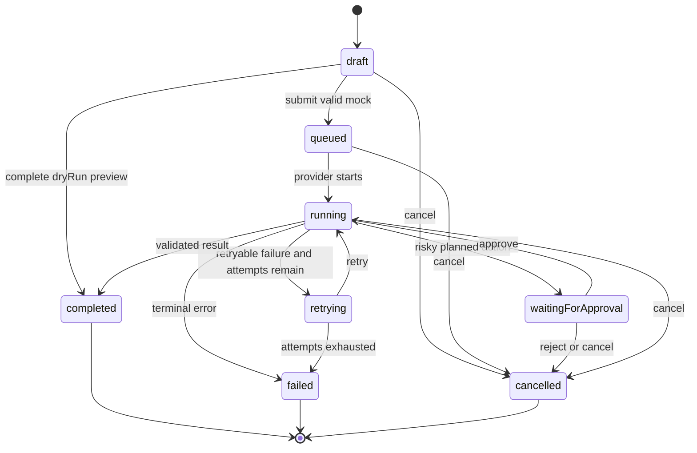

# Sprint 7 Runtime Specification

## Purpose and scope

Implement a deterministic, inspectable local runtime for learning. It does not connect to external AI or tools in 0.7.0.

## Domain model

`ExecutionMode = "mock" | "dryRun" | "liveReserved"`.

`RunStatus = "draft" | "queued" | "running" | "waitingForApproval" | "retrying" | "completed" | "failed" | "cancelled"`.

Core types:

- `RunRequest`: ID, agent/prompt snapshot, input, variables, mode, requestedAt, optional deterministic scenario.
- `RunContext`: request, normalized input, provider/tool registries, attempt, cancellation signal, approvals, fixed clock/ID source.
- `RunEvent`: ID, runId, sequence, timestamp, kind, status, safe summary, optional structured details.
- `RunResult`: status, output, validation, attempts, started/completed timestamps, warnings, event timeline.
- `ValidationOutcome`: valid flag plus field/code/message issues.
- `ApprovalRequest`: ID, risk level, proposed action, exact summary, required/decided timestamps, decision.
- `RetryPolicy`: maxAttempts (default 2, maximum 3), retryable error codes, deterministic backoff labels; no real delay required in tests.
- `ProviderStatus`: provider ID/name, `mockReady | notConfigured | disabled`, capability labels, honest reason.

All persisted shapes include schemaVersion and are validated from unknown.

## Provider and tool contracts

```ts
interface RuntimeProvider {
  readonly id: string;
  getStatus(): ProviderStatus;
  validate(request: RunRequest): ValidationOutcome;
  execute(context: RunContext): Promise<ProviderRunResponse>;
  cancel(runId: string): Promise<void>;
}
```

`MockProvider` uses normalized request content plus fixture version to select deterministic events/output. It performs no network calls, random generation, arbitrary waiting, or imported-text execution.

`ProviderRegistry` resolves only registered providers. `liveReserved` has no executable adapter and returns `notConfigured`. `ToolRegistry` describes planned tools, input schemas, risk, and approval requirements; it executes nothing in 0.7.0.

## Mode behavior

- **mock:** validates, queues, runs deterministic provider output, pauses for declared approvals, validates result, and records history.
- **dryRun:** validates and displays assembled prompt, variables, planned tools, approval points, estimated steps, and warnings; it never calls `execute` and labels previews as non-results.
- **liveReserved:** disabled in UI and rejected by domain validation with a secure-architecture explanation. It must not accept keys.

## State machine



Invalid transitions return a typed error and do not mutate state. Cancellation is idempotent for queued/running/waiting/retrying and cannot rewrite terminal history.

## Failure, retry, approval, and cancellation

Failures use stable codes, safe user messages, optional developer detail without sensitive content, retryable flag, and recovery action. Never expose raw stack traces in UI. Approval defaults to deny, states consequences, and requires a fresh explicit decision per risky action. Retry events show attempt/max and reason. Cancellation produces a terminal event and ignores late provider completion.

## Run history

- Storage key: `shabis-ai-academy.runtime.runs.v1`
- Maximum retained runs: **50**, newest first; evict oldest after successful write.
- Store snapshots needed to explain a run, not whole catalogs, secrets, raw stack traces, or provider credentials.
- Support view, filter, detail, delete one, and clear all with confirmation.
- Malformed/unknown versions recover to an empty safe state, preserve the application, and expose a non-sensitive warning.
- History is local to the browser; show privacy copy advising against sensitive inputs.

## Routes and UI

- `/runs`: history list, filters, empty state, clear action.
- `/runs/:runId`: request summary, mode/provider status, accessible ordered timeline, approvals, attempts, warnings, output, delete.
- Runtime controls appear in [playgrounds](04-playground.md).
- Timeline status is text plus icon/color. Focus moves to new approval/dialog headings and restores on close. Updates use a restrained live region.

## Determinism and testing

Inject clock and ID factories. Identical normalized request + scenario + fixture version yields the same semantic events/output. Timestamps/IDs may differ only when the test does not inject them.

Vitest covers validation, every valid/invalid transition, provider contracts, Dry Run non-execution, live rejection, approval decisions, retry exhaustion, cancellation races, event ordering, bounds, migration/corruption, and determinism. Playwright covers both playground flows, timelines, keyboard approvals, cancellation, history refresh/delete, directions/mobile, axe, visual states, and disabled Live.

Related: [runtime architecture](../architecture/runtime.md), [security](../architecture/security.md), [agents](02-starter-agents.md), [tests](07-tests.md).
