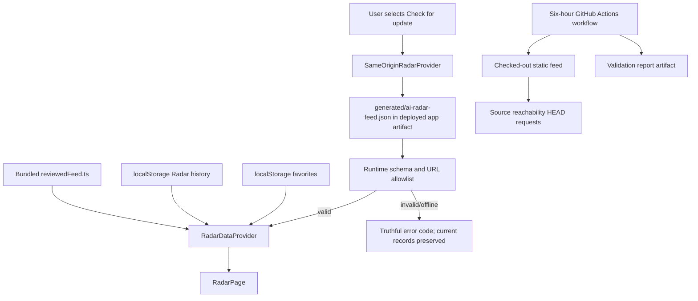
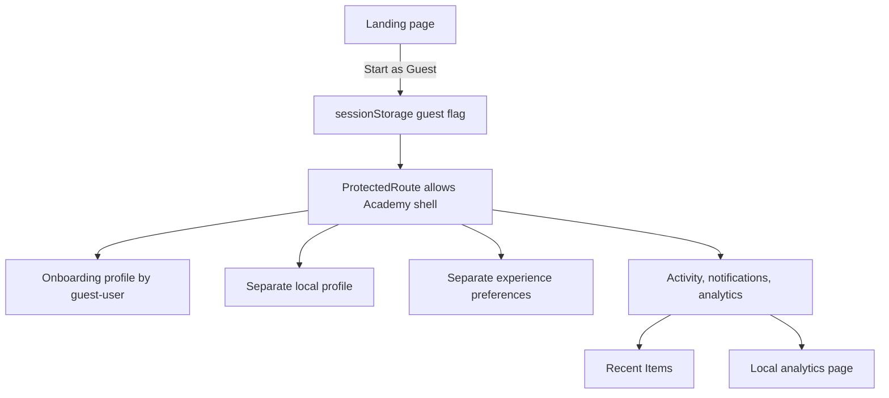
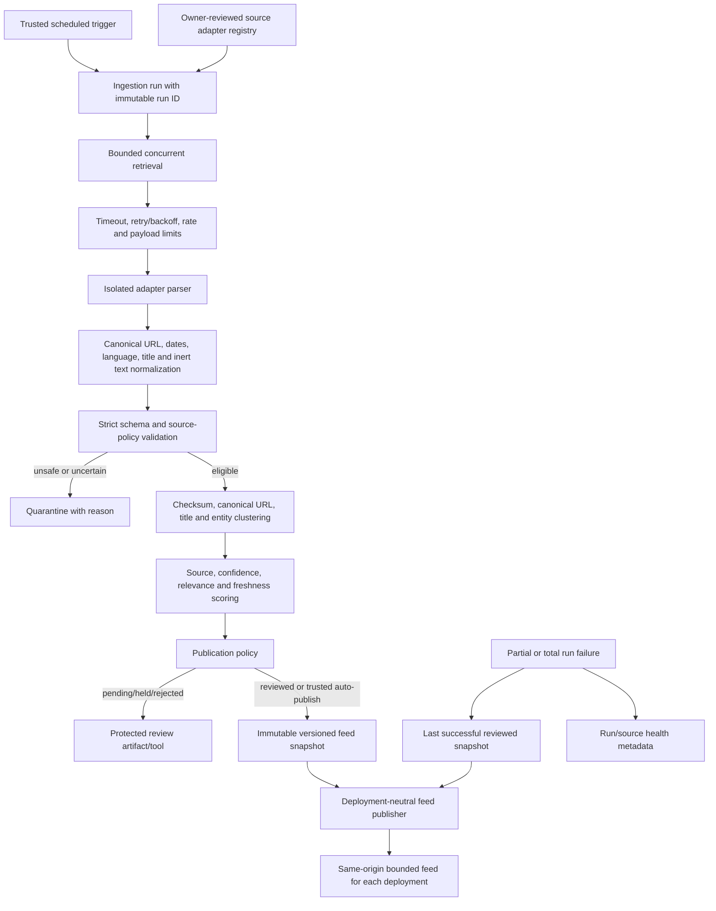
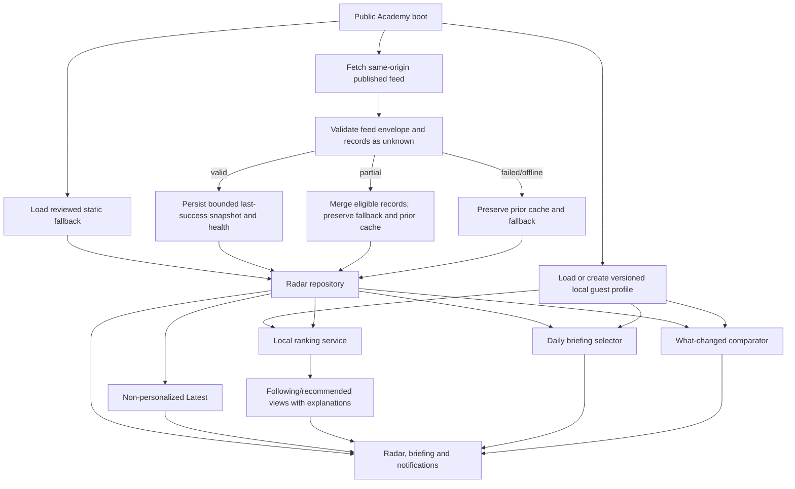
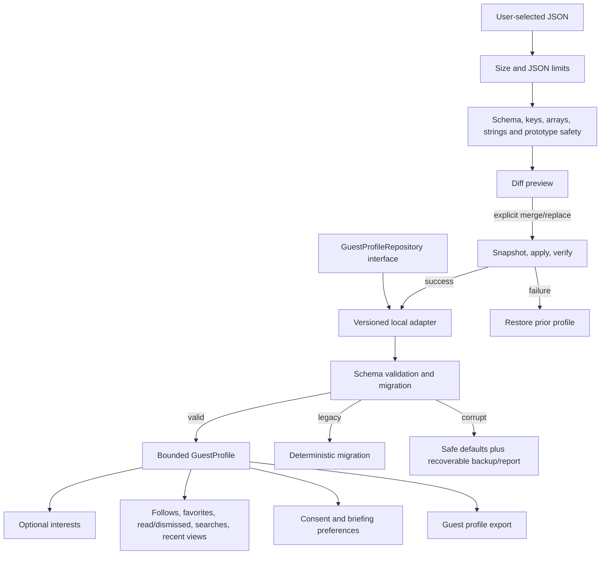

# Version 1.7 data flow

This document separates the confirmed Version 1.6 flow from the proposed
Version 1.7 flow. Dashed or target diagrams are architecture requirements, not
implemented behavior.

## Current Radar flow

Important properties:

- The scheduled workflow does not change the feed.
- The browser refreshes only after user action.
- The online JSON and bundled TypeScript fallback are separate hand-maintained
  copies.
- Local history and favorites are not part of the full workspace export.
- The workflow and runtime use different source allowlists.

## Current guest and personalization flow

There is no unified anonymous guest identity. `guest-user` is a constant
authentication-shaped UI user, while profile, onboarding, experience, Radar,
workspace, and backup use independent storage models.

## Target ingestion and publication flow

The registry is trusted configuration, not client data. Disabling an adapter
changes trusted pipeline configuration and publication state without requiring
a client bundle change. It must not permit arbitrary runtime URLs or
user-submitted adapters.

## Target browser flow

Feed refresh failure cannot write an empty snapshot over the last success.
Records are considered new only when publication/update/correction metadata is
newer than the profile’s last successful visit checkpoint and the feed snapshot
it came from is not stale.

## Target guest-profile flow

## Ownership and trust boundaries

| Data | Owner | Storage/publisher | Browser may change? | May be transmitted? |
| --- | --- | --- | --- | --- |
| Source adapter registry | Academy operations | Trusted repository/service configuration | No | Not required |
| Raw source payload | External publisher; untrusted | Ephemeral trusted ingestion run | No | Retrieved server-side only |
| Quarantine/review record | Academy operations | Protected artifact/tool | No | Operational metadata only |
| Published Radar record | Academy publication pipeline | Same-origin feed plus reviewed fallback | No | Public |
| Feed health | Academy publication pipeline | Same-origin feed metadata | No | Public, non-sensitive |
| Guest profile | User on this device | Versioned local adapter | Yes | Only exported by the user; analytics ID only after consent |
| Feedback text | User | Local draft, then trusted endpoint on submit | Yes | Only after explicit submit |
| Analytics event | User consent boundary | Local queue or trusted endpoint | Reset/opt-out | Only after explicit consent |

## Truthful state model

The client health model must preserve these independent fields:

- `dataSource`: reviewed fallback, last-success cache, or current online feed;
- `refreshState`: idle, refreshing, succeeded, partial, failed, or offline;
- `generatedAt`, `retrievedAt`, `lastSuccessfulRefreshAt`, and
  `lastFailedRefreshAt`;
- per-source health and failed-source count;
- `stale` derived from explicit policy, not from network connectivity;
- snapshot/version/checksum used for new/updated/corrected comparisons.

The UI must not collapse these facts into one “online/offline” boolean.
